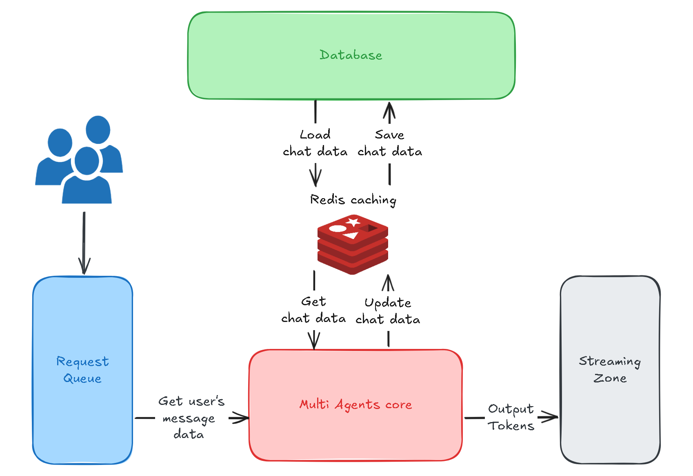
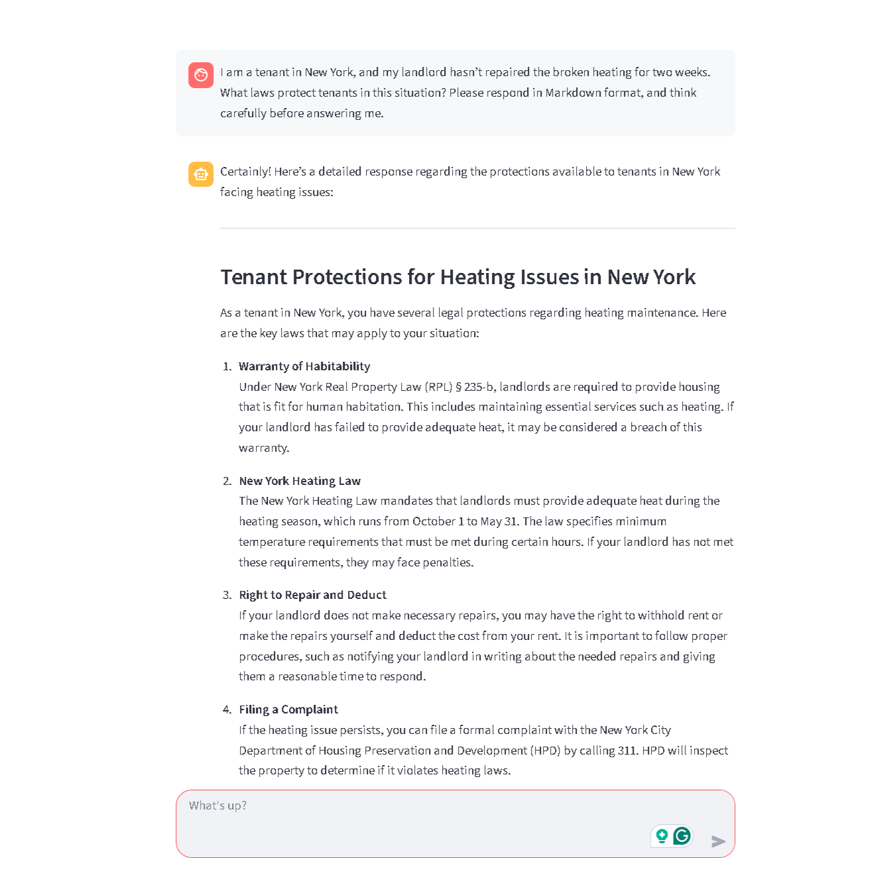

# lawAdvisory ⚖️🤖
[](https://docs.docker.com/compose/)
[](https://qdrant.tech/)
[](https://www.elastic.co/elasticsearch/)
[](https://www.mongodb.com/)
[](https://redis.io/)
[](https://www.langchain.com/)
[](https://fastapi.tiangolo.com/)
[](https://streamlit.io/)

<p align="center"> 
  
  <br>
  <b>Figure 1:</b> System Design
  <br><br><br>
  
  <b>Figure 2:</b> Multi Agents core (detail)
  <br><br><br>
  
  <b>Figure 3:</b> Chatbot UI
</p>


## 📜 Overview
**lawAdvisory** is an AI-powered **Retrieval-Augmented Generation (RAG)** chatbot that helps users quickly find clear, reliable U.S. legal topics across:
- Criminal Law
- Environmental Law
- Civil Law
- International Law
- Labor & Employment Law

## ✨ Key Features
**Multithreaded Chatbot Pipeline**: Built with **LangGraph**, **LangChain**, **LangSmith**, and **OpenAI API** model.

**RAG Pipeline**: Dual retrieval from **Elasticsearch** and **Qdrant** with paraphrasing and generalization techniques, enhanced by **HuggingFace** reranker `BAAI/bge-reranker-v2-m3`.

**DAG-based Memory Tool**: **MongoDB** stores conversation context as a DAG (user message + chatbot response); **Qdrant** (**HuggingFace** embedding model `sentence-transformers/all-MiniLM-L6-v2`) retrieves root nodes; BFS traversal retrieves related parental nodes; **HuggingFace** reranker `BAAI/bge-reranker-v2-m3` ensures top context selection. User's message is then combined with chatbot response embedded in **Qdrant** and encrypted in **MongoDB** with an assigned unique node IDs.

**Message Analysis Node**: Segments user input into context-specific chunks; each chunk can trigger multiple sub-requests based on intent classification.

**Microservices Architecture**: Docker containers for five services: la-qdrant (9001), la-elasticsearch (9002), la-mongodb (9003), la-backend (9004, Swagger UI), la-frontend (9005, Streamlit UI).

**Multi-Agent Support**: Agents for chit-chat, instructional assistance, and law advisory; intent detection routes chunks to the correct agent; **Tavily** data used for final law verification.

**Data Preprocessing**: Clean raw documents by removing icons, images using NLP, PyPDF.

## 🗝 Environment Variables
Create a `.env` in the project root:
```bash
# === API Keys ===
OPENAI_API_KEY=your_openai_api_key
TAVILY_API_KEY=your_tavily_api_key
TAVILY_SEARCH_URL=https://api.tavily.com/search

# === LangChain Tracing === (optional)
LANGCHAIN_TRACING_V2=true
LANGCHAIN_ENDPOINT=https://api.smith.langchain.com
LANGCHAIN_API_KEY=your_langchain_api_key
LANGCHAIN_PROJECT=lawAdvisory

# === Qdrant Config ===
QDRANT_API_KEY=your_qdrant_api_key
QDRANT_URL=https://your-qdrant-instance-url

# === Elasticsearch Config ===
ELASTIC_PASSWORD=your_elastic_password
ELASTIC_HOST=http://la-elasticsearch:9200
ELASTIC_API_KEY=your_elastic_api_key
# Default username: elastic

# === MongoDB Config ===
MONGO_INITDB_ROOT_USERNAME=your_mongo_username
MONGO_INITDB_ROOT_PASSWORD=your_mongo_password
MONGODB_URI=mongodb+srv://<username>:<password>@<cluster-url>/?retryWrites=true&w=majority

# === Service Ports ===
CHATBOT_SERVICE_PORT=9004
```

## 🚀 Getting Started
### 1. Setup
```bash
git clone https://github.com/tanhoangkhoanguyen/lawAdvisory.git
cd lawAdvisory
docker compose up -d --build
```

### 2. Upload Data
```bash
python -m services.data_setup.data_upload
```
> Ensure `.env` is configured before running this step.

### 3. Access Services
| Service                  | Purpose                    | URL                                            |
| ------------------------ | -------------------------- | ---------------------------------------------- |
| **Elasticsearch Status** | Check ElasticSearch health            | [http://localhost:9002](http://localhost:9002) |
| **Swagger UI**           | Test backend API endpoints | [http://localhost:9004](http://localhost:9004) |
| **Chatbot UI**           | Interact with the chatbot  | [http://localhost:9005](http://localhost:9005) |

## 🤝 Contributing
1. Fork this repository
2. Create a feature branch
3. Commit changes
4. Open a Pull Request

## 📜 License
MIT License – see [LICENSE](https://mit-license.org/)


<p align="center">
  <i>Built with 💙 for a more advanced future</i>
</p>