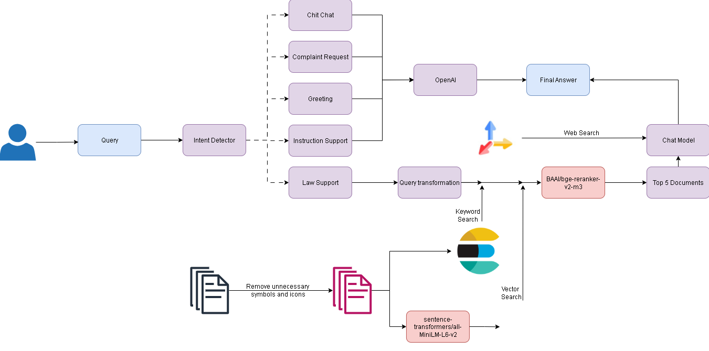

# ⚖️ US LAW ADVISORY
[](https://www.python.org/)
[](https://fastapi.tiangolo.com/)
[](https://qdrant.tech/)
[](https://www.elastic.co/elasticsearch/)



## 📌 Why This Project?
Accessing clear, reliable, and current U.S. legal information can be overwhelming - laws cover many areas, resources are scattered, and finding the right answer often takes hours. We built US LAW ADVISORY to help students and the public quickly find trustworthy legal references, save time, and navigate complex legal topics without the frustration of endless searching.

## 📜 Overview
**US LAW ADVISORY** is an AI-powered **Retrieval-Augmented Generation (RAG)** chatbot that helps users search and understand U.S. legal topics across:

- **Criminal Law**
- **Environmental Law**
- **Civil Law**
- **International Law**
- **Labor & Employment Law**

## ✨ Key Features
| Feature | Description |
|---------|-------------|
| **Intelligent Legal Search** | Combines Qdrant (vector search) & Elasticsearch (keyword search) |
| **RAG Pipeline** | Generates grounded, context-aware responses |
| **Multi-Domain Support** | Handles multiple legal categories |
| **Advanced Models** | `all-MiniLM_L6-v2` for embeddings + `bge-reranker-v2-m3` for reranking |

## 🛠 Technology Stack
**Backend**  
- Python 3.10  
- FastAPI (REST API)  
- Docker Compose (container orchestration)

**AI & Retrieval**  
- Qdrant – Vector database  
- Elasticsearch – Keyword-based indexing  
- Sentence Transformers – Embeddings  
- BAAI Reranker – Precision boosting

## 🚀 Getting Started
### 1. Prerequisites
- Docker & Docker Compose installed  
- Ports `9002`, `9004`, and `9005` available  

### 2. Setup & Run
**2.1 Clone reposity**
```bash
git clone https://github.com/tanhoangkhoanguyen/lawAdvisory.git
cd lawAdvisory
```

**2.2 Create a `.env`**
```env
# === API Keys ===
OPENAI_API_KEY=your_openai_api_key
TAVILY_API_KEY=your_tavily_api_key
TAVILY_SEARCH_URL=https://api.tavily.com/search

# === LangChain Tracing === (optional)
LANGCHAIN_TRACING_V2=true
LANGCHAIN_ENDPOINT=https://api.smith.langchain.com
LANGCHAIN_API_KEY=your_langchain_api_key
LANGCHAIN_PROJECT=lawAdvisory

# === Qdrant Config ===
QDRANT_API_KEY=your_qdrant_api_key
QDRANT_URL=https://your-qdrant-instance-url

# === Elasticsearch Config ===
ELASTIC_PASSWORD=your_elastic_password
ELASTIC_HOST=http://la-elasticsearch:9200
ELASTIC_API_KEY=your_elastic_api_key
# Default username: elastic

# === MongoDB Config ===
MONGO_INITDB_ROOT_USERNAME=your_mongo_username
MONGO_INITDB_ROOT_PASSWORD=your_mongo_password
MONGODB_URI=mongodb+srv://<username>:<password>@<cluster-url>/?retryWrites=true&w=majority

# === Service Ports ===
CHATBOT_SERVICE_PORT=9004
```

**2.3 docker orchestration**
```bash
docker compose up -d --build
```

### 3. Upload Data
```bash
python -m services.data_setup.data_upload
```
> 💡 Ensure `.env` is configured before running this step.

### 4. Access Services
| Service                  | Purpose                    | URL                                            |
| ------------------------ | -------------------------- | ---------------------------------------------- |
| **ElasticSearch Status** | Check ES health            | [http://localhost:9002](http://localhost:9002) |
| **Swagger UI**           | Test backend API endpoints | [http://localhost:9004](http://localhost:9004) |
| **Chatbot UI**           | Interact with the chatbot  | [http://localhost:9005](http://localhost:9005) |

## 📂 Repository Structure
```
backend/
 ├─ data_setup/
 │   ├─ cleaned_documents/
 │   │   ├─ civil_law/
 │   │      └─ example.pdf
 │   │   ├─ criminal_law/
 │   │      └─ example.pdf
 │   │   ├─ environmental_law/
 │   │      └─ example.pdf
 │   │   ├─ international_law/
 │   │      └─ example.pdf
 │   │   └─ labor_and_employment_law/
 │   │      └─ example.pdf
 │   │
 │   ├─ raw_documents/
 │   │   ├─ civil_law/
 │   │   ├─ criminal_law/
 │   │   ├─ environmental_law/
 │   │   ├─ international_law/
 │   │   └─ labor_and_employment_law/
 │   │
 │   ├─ data_upload.py                                # Upload cleaned data
 │   ├─ elastic_setup.py                              # Elasticsearch indexes setup
 │   ├─ mongodb_setup.py                              # MongoDB initialization
 │   └─ qdrant_setup.py                               # Qdrant collections setup
 │
 ├─ services/chatbot/                                
 │   ├─ app/
 │   │   ├─ main.py                                  # API entry point
 │   │   ├─ route.py                                 # Defines API routes
 │   │   └─ request_schemas.py                       # Pydantic request/response models
 │   │
 │   ├─ assets/
 │   │   ├─ graph.png                                # Architecture diagram
 │   │   └─ system_overview.png                      # System overview diagram
 │   │
 │   └─ core/
 │       ├─ agents/
 │       │   ├─ general.py                           # General-purpose chatbot agent
 │       │   └─ law_advisory.py                      # Law advisory agent
 │       │
 │       ├─ constants/
 │       │   ├─ prompts.py                           # Prompt templates
 │       │   └─ schemas.py                           # Schema definitions
 │       │
 │       ├─ retriever/
 │       │   ├─ elastic.py                           # Elasticsearch retriever
 │       │   ├─ qdrant.py                            # Qdrant retriever
 │       │   └─ tavily.py                            # Tavily API retriever
 │       │
 │       ├─ tools/
 │       │   ├─ helper.py                            # Query transformation
 │       │   ├─ rerank.py                            # Reranking retrieved
 │       │   └─ retrieve_context.py                  # Building final context
 │       │
 │       ├─ main.py                                  # Core chatbot orchestration
 │       └─ workflow.py                              # Defines chatbot workflow logic
 |
 ├─ test/chatbot.py                                  # System tests
 
frontend/
 ├─ app.py                                           # Main frontend app entry point
 ├─ run.py                                           # Development server runner
 ├─ constants/chatbot_schemas.py                     # Shared chatbot schemas
 └─ requirements.txt                                 # Frontend dependencies

qdrant_config/                                       # Qdrant config files
qdrant_data/                                         # Local Qdrant DB storage
docker-compose.yml                                   # Service orchestration
.env                                                 # Environment variables
README.md                                            # Project documentation
```

## 🤝 Contributing
1. Fork this repository
2. Create a feature branch
3. Commit changes
4. Open a Pull Request

## 📜 License
MIT License – see [LICENSE](https://mit-license.org/)


<p align="center">
  <i>Built with 💙 for a more advanced future</i>
</p>