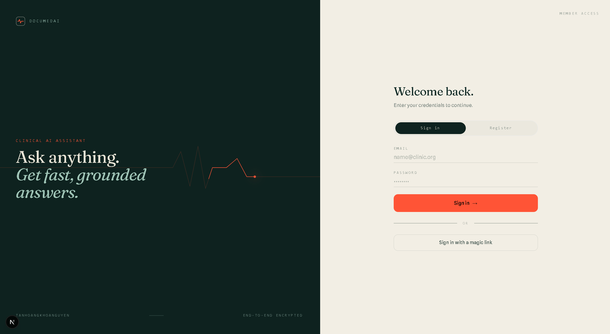
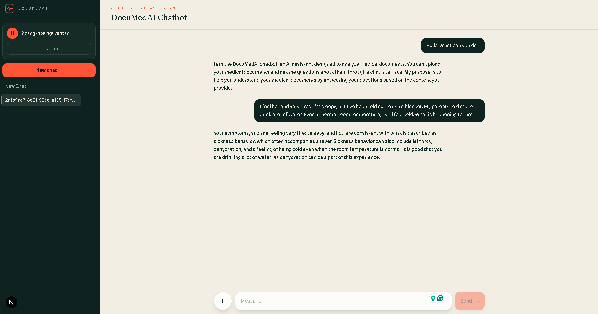

<h1 align="center">🩺 DocuMedAI</h1>
<p align="center"><em>Upload your medical documents. Ask in plain language. Get answers you can trust.</em></p>

<p align="center">
  
  
  
  
  
  
  
  
  
  
  
  
  
  
  
</p>




## Why

Medical paperwork is dense, and generic chatbots guess, hallucinate, and forget. DocuMedAI remembers your conversation, reasons through a
multi-agent workflow, and runs on production-grade infrastructure.

- **Grounded** - RAG over your docs (Qdrant + cross-encoder reranking); weak matches are dropped, not fabricated.
- **Persistent** - short-term context plus long-term memory recalled across topics.
- **Hardened** - Go LLM gateway (admission control, rate limit, retry, per-route circuit breaker), JWT + Supabase auth.

## Stack

| Layer | Tech | Port |
|-------|------|------|
| Frontend | Next.js 15 / React 19 | 2011 |
| Backend | FastAPI | 2010 |
| LLMGuard | Go gateway → Gemini (OpenAI-compatible) | 8081 |
| RAG | Qdrant + BAAI reranker | 6333 |
| Memory | Redis → MongoDB | 6379 / 27017 |

Each message flows: **TopicChecker → MessageAnalysis → LongTermMemory → Agents (CrewAI + RAG) → SchemaUpdater**.

## Fast API

| Method | Path | |
|--------|------|--|
| POST | `/auth/register` · `/auth/login` · `/auth/supabase-sync` | auth |
| GET | `/auth/me` | current user |
| GET · POST | `/chats` | list / create |
| PATCH | `/chats/{id}` | rename |
| GET · POST | `/chats/{id}/messages` | history / send |
| POST | `/chats/{id}/messages/stream` | stream reply (SSE) |
| GET | `/health` | liveness |

**Frontend** (`:2011`) — chat UI + `/api/*` routes proxying the backend.
**LLMGuard** (`:8081`) — `/v1/*` completions, `/healthz`, `/metrics`.

## Vector DB benchmark

Five engines (Qdrant, Milvus, Weaviate, Vespa, ChromaDB) benchmarked the honest way - [ann-benchmarks](https://github.com/erikbern/ann-benchmarks) style, latency compared at equal recall. Lab lives in [`backend/VectorBench/`](backend/VectorBench/).

## LLMGuard

A **Go gateway** in front of the LLM provider: clients speak the OpenAI wire
format, a provider adapter translates to the vendor's native API. Adding an
OpenAI-compatible upstream is **config only, no Go code**. Lives in
[`backend/llmguard/`](backend/llmguard/).

Admission control, Redis token bucket, retry with backoff, and a circuit breaker
keyed per `(provider, model)` route — not per upstream, so one bad model can't
take a healthy one down with it. Breaker trips are shared across replicas via
Redis so N replicas don't each re-learn the same outage.

```bash
docker compose up -d --build la-llmguard       # http://localhost:8081
```

Benchmarked open-loop against a deterministic mock upstream:

| | measured |
|---|---|
| Overhead vs calling the upstream direct | **+2.6 ms** p50 · +7.0 ms p99 |
| Tracing cost on the request path | **0.0 ms** at p50, p95, p99 |
| Through an 8s upstream outage | **6.22%** client errors — retry rescued ~⅓, cost paid only at p99 |
| Goodput from 2× to 8× overload | holds **63.8 → 65.3 rps**, served p50 flat |

Degrades by refusing work, never by getting slower for everyone. Full tables and
the baseline that was *rejected* as too noisy to use:
[`backend/llmguard/README.md`](backend/llmguard/README.md#measured) ·
[`docs/benchmarks/llmguard-results.md`](docs/benchmarks/llmguard-results.md).
## MCP server

The RAG tools exposed over real **Model Context Protocol** (JSON-RPC 2.0, streamable-HTTP) so external hosts - Claude Desktop, MCP Inspector - can call them. **One core, two surfaces**: the same `toolcore` executes for both the in-process LangGraph agent and remote MCP clients, so per-user isolation is enforced once, in `call_tool`. Lives in [`backend/mcp_server/`](backend/mcp_server/).

```bash
docker compose --profile mcp up -d --build la-mcp-server     # http://localhost:8090/mcp
```

Benchmarked on the same open-loop discipline as the vector DB lab - latency charged from each request's *ideal* send time, so saturation shows as rising latency, not reduced load:

| | measured |
|---|---|
| Protocol overhead vs in-process | **4.8 ms** p50 (n=10,000/arm, loopback) |
| Sustained throughput | **150 rps @ 13 ms** p50 (2 VMs, 4 vCPU server and 8 vCPU client) |
| Under 4× overload (800 qps) | throughput holds ~162 rps, **100% success, zero transport errors** |

Degrades by queueing, never by failing. Full tables, honest caveats, and the load-generator calibration that made the tail numbers trustworthy: [`backend/mcp_server/README.md`](backend/mcp_server/README.md#performance) · two-VM setup: [`docs/benchmarks/mcp-procedure.md`](docs/benchmarks/mcp-procedure.md).

## Run

```bash
cp .env.example .env        # fill in keys
docker compose up -d --build
```

